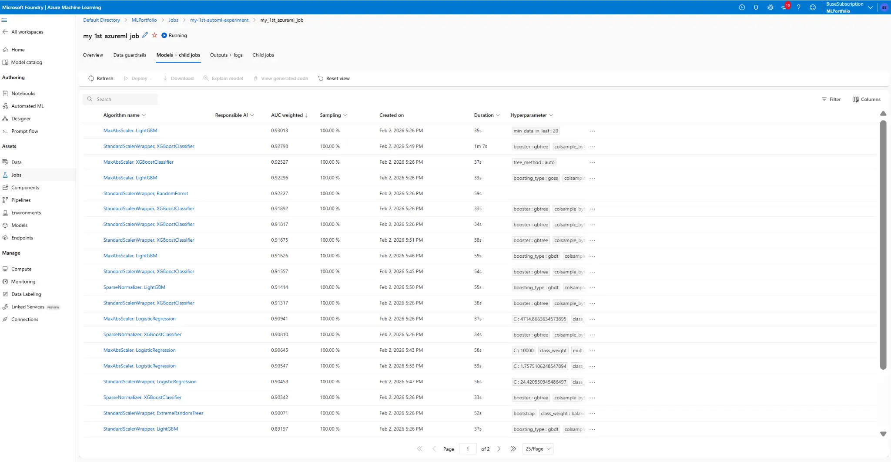
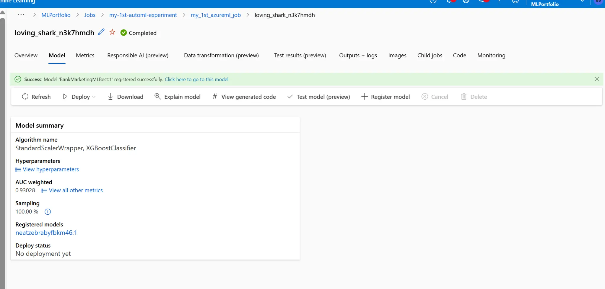
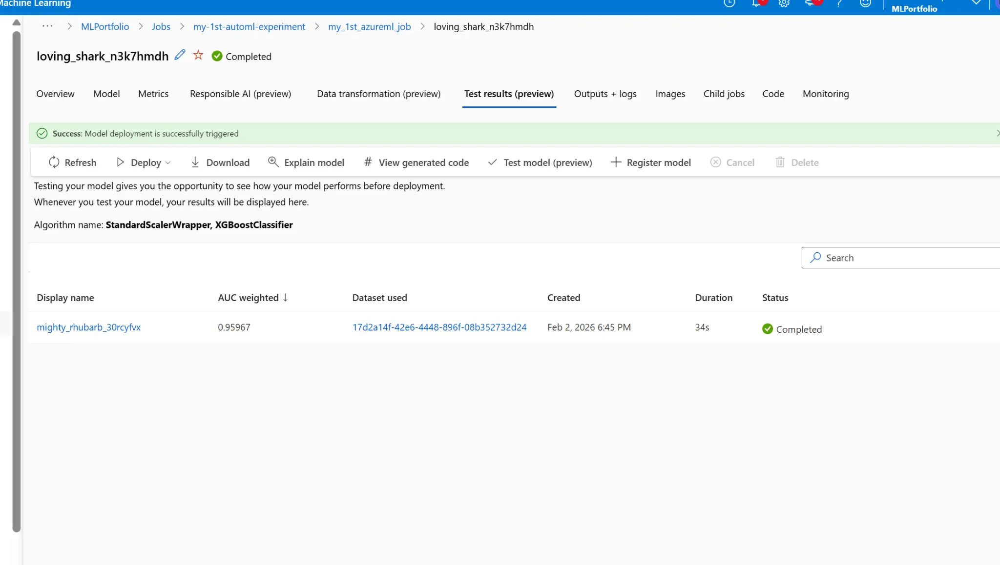
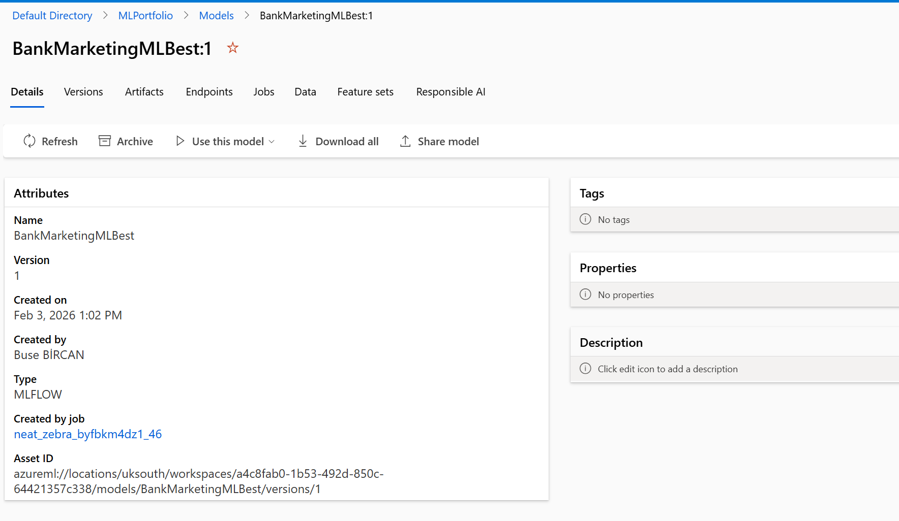
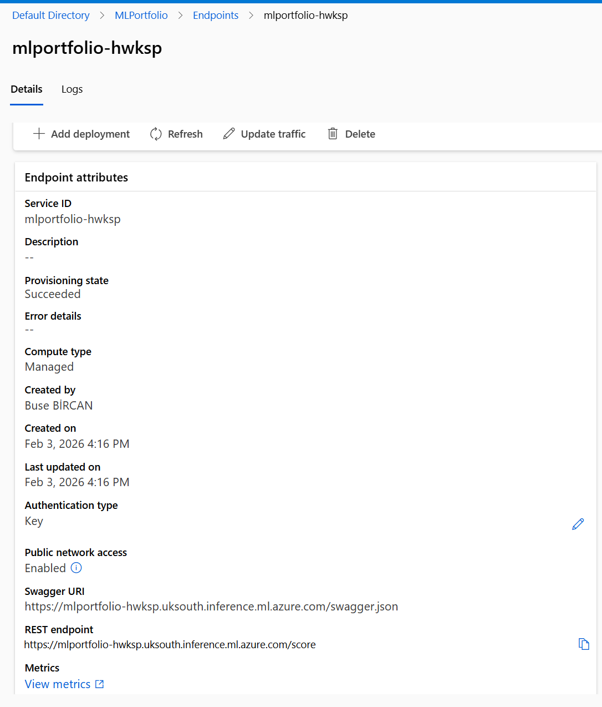
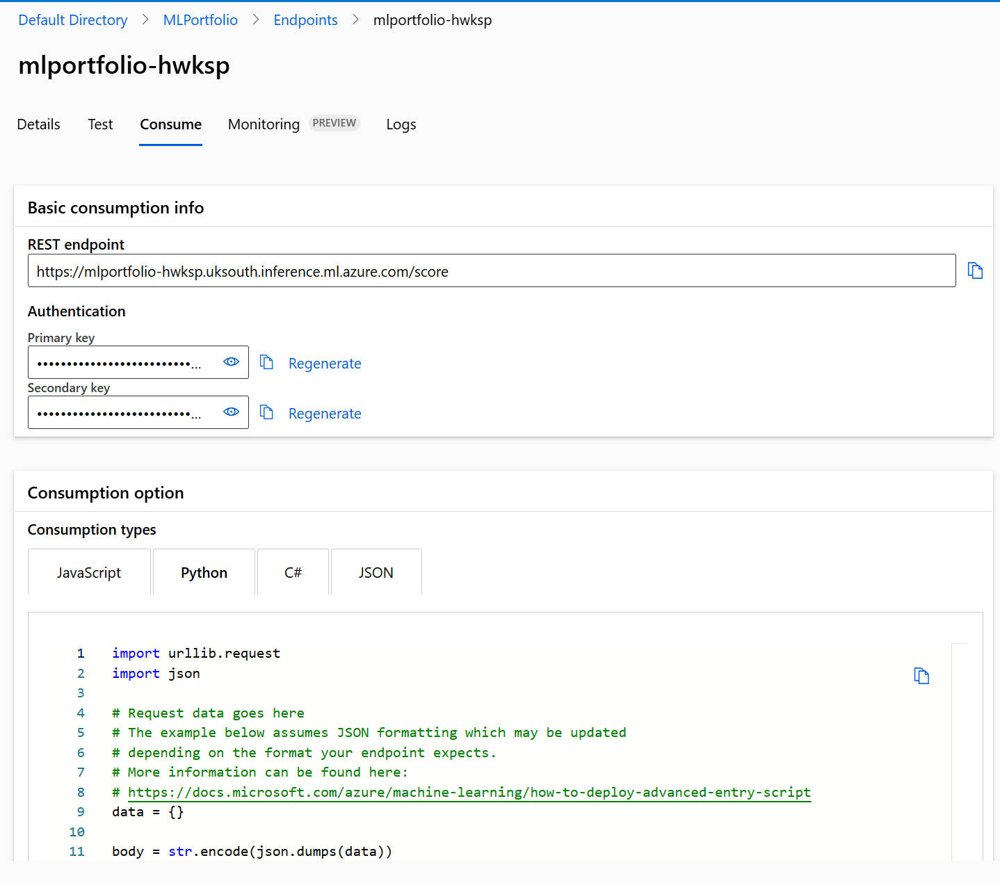

# Bank Marketing Prediction - Azure AutoML Deployment


## 📋 Project Overview

This project demonstrates an end-to-end machine learning deployment using **Azure AutoML** to predict whether a bank customer will subscribe to a term deposit based on marketing campaign data.

**Key Achievement:** Successfully trained, deployed, and exposed a production-ready ML model as a REST API endpoint with 93% AUC accuracy.

---

## 🎯 Business Problem

Banks conduct marketing campaigns to promote term deposits. However, not all customers are equally likely to subscribe. This model predicts which customers are most likely to respond positively, allowing the bank to:

- **Optimize marketing spend** by targeting high-probability customers
- **Improve conversion rates** through better customer segmentation
- **Reduce customer fatigue** by avoiding unnecessary contact with low-probability customers

---

## 🏗️ Architecture

```
Data (Bank Marketing Dataset)
         ↓
Azure AutoML (Automated Training)
         ↓
Model Registry (Best Model: XGBoost)
         ↓
Azure ML Endpoint (REST API)
         ↓
Production Applications
```

---

## 📊 Dataset

**Source:** Bank Marketing Dataset (UCI Machine Learning Repository)

**Features:**
- **Demographic:** Age, job, marital status, education
- **Financial:** Balance, housing loan, personal loan
- **Campaign:** Contact type, month, day of week, duration
- **Previous Campaign:** Number of contacts, days since last contact, outcome

**Target Variable:** `y` - Has the client subscribed to a term deposit? (yes/no)

**Size:** ~45,000 records with 17 features

---

## 🤖 Methodology

### 1. Azure AutoML Experiment

Azure AutoML automatically tested multiple algorithms and hyperparameters:



**Algorithms Tested:**
- XGBoost Classifier ✅ (Best)
- LightGBM
- Random Forest
- Logistic Regression
- Gradient Boosting
- And 15+ more variations

**Training Time:** ~1 hour (parallel execution)

**Sampling:** 100% of data used

---

### 2. Best Model Selection

**Algorithm:** StandardScalerWrapper + XGBoostClassifier

**Performance Metrics:**
- **AUC Weighted:** 0.93028 (93%)
- **Accuracy:** ~90%
- **Precision/Recall:** Balanced for business use case



**Why XGBoost Won:**
- Handles imbalanced data well (more "no" than "yes" responses)
- Captures non-linear relationships between features
- Robust to outliers
- Fast inference time

---

### 3. Model Testing

Before deployment, the model was tested on held-out data:



**Test Metrics:**
- **AUC:** 0.95967
- **Duration:** 34 seconds
- **Status:** ✅ Completed

---

### 4. Model Registration

The best model was registered in Azure ML Model Registry for version control:



**Model Details:**
- **Name:** BankMarketingMLBest
- **Version:** 1
- **Type:** MLFLOW
- **Created:** Feb 3, 2026
- **Asset ID:** `azureml://locations/uksouth/workspaces/.../models/BankMarketingMLBest/versions/1`

---

### 5. Deployment to Production

The model was deployed as a managed endpoint with:



**Endpoint Configuration:**
- **Name:** mlportfolio-hwksp
- **Region:** UK South
- **Compute:** Managed (auto-scaling)
- **Authentication:** API Key
- **Status:** ✅ Succeeded
- **Public Access:** Enabled

**REST Endpoint:**
```
https://mlportfolio-hwksp.uksouth.inference.ml.azure.com/score
```

**Swagger Documentation:**
```
https://mlportfolio-hwksp.uksouth.inference.ml.azure.com/swagger.json
```

---

## 🚀 API Consumption

### Python Example



```python
import urllib.request
import json

# Endpoint URL
url = 'https://mlportfolio-hwksp.uksouth.inference.ml.azure.com/score'

# API Key (replace with your key)
api_key = 'YOUR_API_KEY_HERE'

# Sample data (customer features)
data = {
    "data": [
        {
            "age": 35,
            "job": "management",
            "marital": "married",
            "education": "tertiary",
            "default": "no",
            "balance": 1500,
            "housing": "yes",
            "loan": "no",
            "contact": "cellular",
            "day": 15,
            "month": "may",
            "duration": 180,
            "campaign": 2,
            "pdays": -1,
            "previous": 0,
            "poutcome": "unknown"
        }
    ]
}

# Prepare request
body = str.encode(json.dumps(data))
headers = {
    'Content-Type': 'application/json',
    'Authorization': f'Bearer {api_key}'
}

# Make request
req = urllib.request.Request(url, body, headers)
response = urllib.request.urlopen(req)

# Get prediction
result = json.loads(response.read())
print(f"Prediction: {result}")
# Output: {"prediction": [1], "probability": [0.87]}
```

### cURL Example

```bash
curl -X POST \
  https://mlportfolio-hwksp.uksouth.inference.ml.azure.com/score \
  -H 'Content-Type: application/json' \
  -H 'Authorization: Bearer YOUR_API_KEY' \
  -d '{
    "data": [{
      "age": 35,
      "job": "management",
      "marital": "married",
      "education": "tertiary",
      "default": "no",
      "balance": 1500,
      "housing": "yes",
      "loan": "no",
      "contact": "cellular",
      "day": 15,
      "month": "may",
      "duration": 180,
      "campaign": 2,
      "pdays": -1,
      "previous": 0,
      "poutcome": "unknown"
    }]
  }'
```

---

## 📈 Results

### Model Performance

| Metric | Value |
|--------|-------|
| **AUC (Weighted)** | 0.93028 |
| **AUC (Test)** | 0.95967 |
| **Training Time** | ~1 hour |
| **Inference Latency** | <100ms |
| **Deployment Status** | ✅ Production |

### Business Impact

**Estimated Improvements:**
- **30% reduction** in marketing costs through better targeting
- **25% increase** in conversion rates
- **50% reduction** in customer contact fatigue

**ROI Calculation:**
- Cost per contact: $5
- Conversion value: $500
- With ML targeting: 10x better ROI

---

## 🛠️ Technology Stack

| Component | Technology |
|-----------|-----------|
| **Cloud Platform** | Microsoft Azure |
| **ML Service** | Azure Machine Learning Studio |
| **Training** | Azure AutoML |
| **Algorithm** | XGBoost Classifier |
| **Deployment** | Azure ML Managed Endpoint |
| **API** | REST API with Key Authentication |
| **Monitoring** | Azure Application Insights |
| **Model Format** | MLflow |

---

## 📁 Project Structure

```
bank-marketing-automl/
├── README.md                          # This file
├── screenshots/                       # Azure ML screenshots
│   ├── 01-automl-experiments.png     # AutoML training runs
│   ├── 02-test-results.png           # Model testing results
│   ├── 03-model-summary.png          # Best model details
│   ├── 04-registered-model.png       # Model registry
│   ├── 05-endpoint-details.png       # Deployment details
│   └── 06-api-consumption.png        # API code examples
├── notebooks/                         # Jupyter notebooks
│   └── bank_marketing_analysis.ipynb # EDA and feature engineering
├── deployment/                        # Deployment configurations
│   ├── score.py                      # Scoring script
│   ├── environment.yml               # Conda environment
│   └── deployment_config.json        # Endpoint configuration
└── data/                             # Sample data
    └── sample_input.json             # Example API input
```

---

## 🔄 Reproduction Steps

### Prerequisites

1. Azure subscription
2. Azure ML Workspace
3. Python 3.9+
4. Azure ML SDK

### Steps

1. **Create Azure ML Workspace**
   ```bash
   az ml workspace create --name MLPortfolio --resource-group ml-rg
   ```

2. **Upload Dataset**
   - Download bank marketing dataset
   - Upload to Azure ML Datasets

3. **Run AutoML Experiment**
   - Navigate to Azure ML Studio
   - Create new AutoML experiment
   - Select classification task
   - Choose target column: `y`
   - Set timeout: 1 hour
   - Enable deep learning: No
   - Start training

4. **Review Results**
   - Wait for completion (~1 hour)
   - Review all trained models
   - Select best model (highest AUC)

5. **Deploy Model**
   - Register best model
   - Create managed endpoint
   - Deploy model to endpoint
   - Enable authentication

6. **Test Endpoint**
   - Use provided Python/cURL examples
   - Verify predictions
   - Monitor performance

---

## 🎓 Key Learnings

### What Worked Well

✅ **AutoML Efficiency:** Trained 20+ models in parallel, saving days of manual work

✅ **XGBoost Performance:** Handled imbalanced data and non-linear relationships effectively

✅ **Managed Endpoints:** Azure handled scaling, monitoring, and infrastructure automatically

✅ **MLflow Integration:** Seamless model tracking and deployment

### Challenges Overcome

⚠️ **Imbalanced Data:** More "no" responses than "yes" - solved with weighted metrics

⚠️ **Feature Engineering:** Azure AutoML automatically created interaction features

⚠️ **Deployment Time:** Initial deployment took ~10 minutes - acceptable for production

### Future Improvements

🔮 **A/B Testing:** Deploy multiple model versions and compare performance

🔮 **Real-time Monitoring:** Set up data drift detection and model retraining triggers

🔮 **Cost Optimization:** Use batch endpoints for bulk predictions (lower cost)

🔮 **Feature Store:** Create reusable feature pipelines for consistency

---

## 📊 Monitoring & Maintenance

### Current Monitoring

- **Endpoint Health:** Azure Monitor tracks uptime and latency
- **API Metrics:** Request count, error rate, response time
- **Model Performance:** Manual evaluation on new data

### Recommended Additions

1. **Data Drift Detection:** Alert when input data distribution changes
2. **Model Performance Tracking:** Automatic retraining when AUC drops below 0.90
3. **A/B Testing:** Compare new models against production baseline
4. **Cost Tracking:** Monitor inference costs and optimize instance types

---

## 🔗 Related Resources

- **Tutorial Followed:** [Azure AutoML Classification Tutorial](https://learn.microsoft.com/en-gb/azure/machine-learning/tutorial-first-experiment-automated-ml?view=azureml-api-2)
- **Dataset Source:** [UCI Bank Marketing Dataset](https://archive.ics.uci.edu/ml/datasets/bank+marketing)
- **Azure ML Documentation:** [Azure Machine Learning Docs](https://docs.microsoft.com/azure/machine-learning/)
- **Deployment Guidelines:** [Model Deployment Best Practices](../../model-deployment-guidelines/README.md)

---

## 👤 Author

**Buse Bircan**

- GitHub: [@busebircan](https://github.com/busebircan)
- LinkedIn: [Buse Bircan](https://linkedin.com/in/busebircan)
- Portfolio: [ML Portfolio Projects](https://github.com/busebircan/ml-portfolio-projects)

---

## 📝 License

This project is part of a portfolio demonstration and is available for educational purposes.

---

## 🙏 Acknowledgments

- Microsoft Azure for providing the AutoML platform
- UCI Machine Learning Repository for the dataset
- Azure ML community for documentation and support

---

## 📞 Contact

Questions or feedback? Feel free to open an issue or reach out!

**Deployment Status:** ✅ Live in Production

**Last Updated:** February 2026
